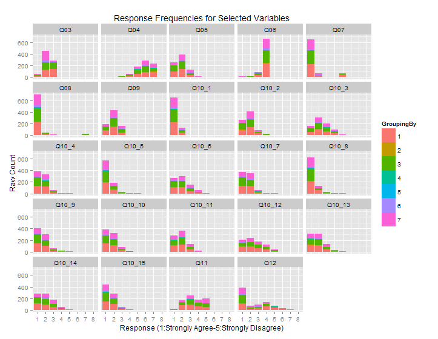

Final Project
==============================

| **Name**  | Octavio Suarez Munist  |
|----------:|:-------------|
| **Email** | osuarezmunist@dons.usfca.edu |

## Introduction ##
The purpose of this prototype was to explore the benefits of using visualizations to quickly assess the potential value of a survey of students. I regularly have to analyze results of questionnaires administered by third parties with no previous knwoledge or information about the origin of the questions or the purpose of the survey. In additon to basic descriptives, I am trying to (1) eliminate uninteresting or mal-functioning questions, (2) group questions into dimensions and/or indexes and (3) select dependent and independent variables for regressions. This requires an iterative process to select variables of interest and group into associated sets. I am exploring the use of visualizations to (1) more efficiently make the first "cuts" of the variables and (2) reduce the number and length of interations to the final selection and grouping of the variables of interest. 

I envision this being a useful tool for me and my colleagues doing similar work.I expect to end up with 8-10 visualizations that can be used across many similar questionniares, but do not expect all visualizations to work for all data sets.

### Data Set ###
I selected a typical data set of around 800 reponses to a pre-course survey of a college chemistry course. Variable types were limited to categorical and discrete ordinal, mostly 5-point Likert scale. The homogeneity of the ordinal variables reduces the rescaling and recoding significnatly. The questions can be seen in the DataDictionaryR.csv file. There are a total of 50 questions. I could not include the response labels because on the public version of the data, but all ordinal questions are multiple choice with a short range of response values.  

### Techniques ###
A major issue when dealing with long lists of variables is displaying the associated question prompts. Since the prompts are arbitrarily long and not easy so reduce to a few characters, I chose to use the variable/column names in all visualization. This is in line with what is done in the anlaysis, although final results would need to include prompts. I provided a tab with the variable names and associated prompts so users can easily look these up.

#### Small Multiples ####
This will usually be the place to start exploring the data set. First, I explored visualizations of summary statistics such as mean, mode, and skewness. However, visualizing the shape of the distribution proved to be most efficient way to identify variables with problematic distributions. For example, in the plot below, variables Q06, Q07, Q08 stand out very clearly as having an extreme response pattern with little variance. (I will discuss the use of color in the interactivity section).

LIE FACTOR: This is a major concern when looking at a dynamic set of variables because the scales can change dramatically depending on the set of variables. In the plot below, Q12 has a 7-point that extends the x-axis. 
DATA DENSITY: Small multiples are quite dense to begin with, even when the response scale varies slighlty.  
DATA TO INK RATIO: Again, small multiples have very good DTI raio, but require a lot of mental processing. While the axis labels are repeated, the alternatives would increase eye travel. I tried including the question prompts for each sub-plot, but this turn the small into large multiples.

#### HeatMap ####
