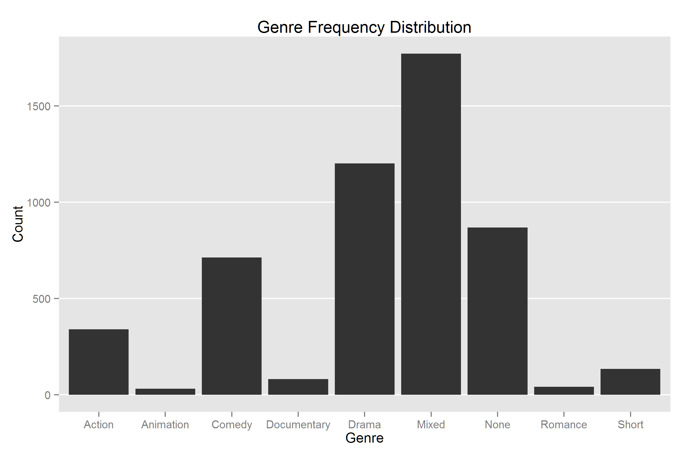
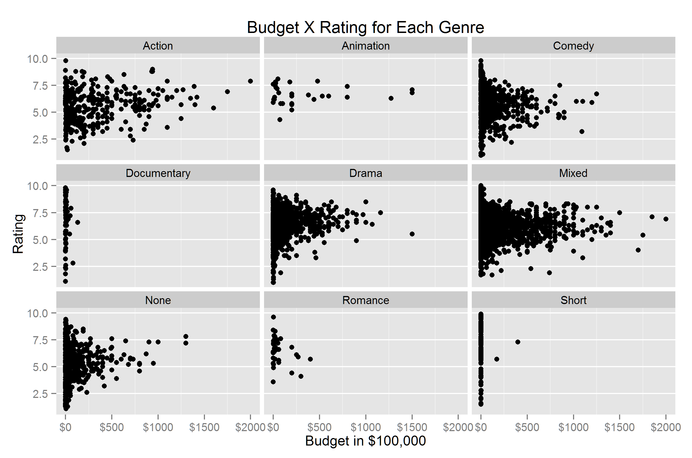
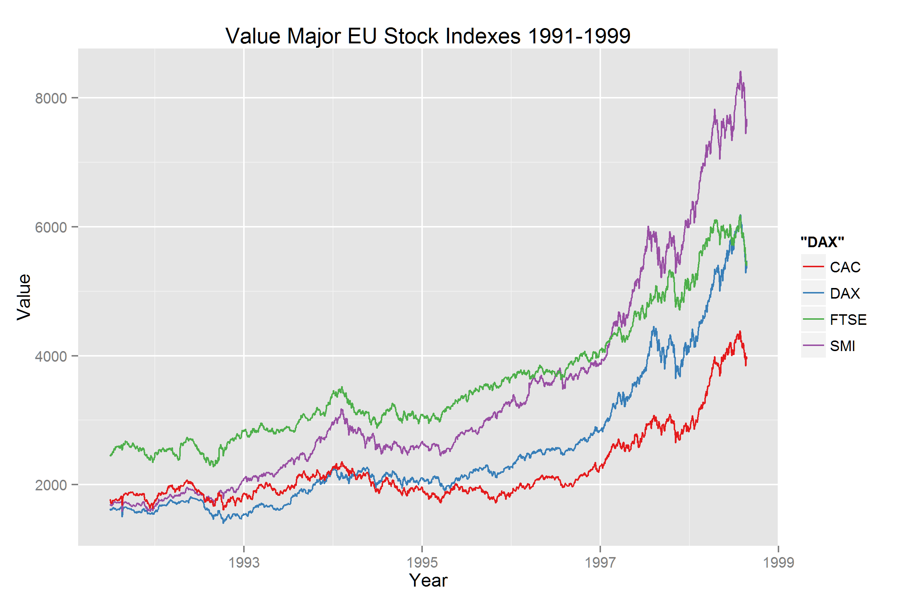

Homework 1: Basic Charts
==============================

| **Name**  | Octavio Suarez Munist  |
|----------:|:-------------|
| **Email** | osuarezmunist@dons.usfca.edu |

## Instructions ##

Change to desired working directory and run hw1.r to produce all 4 charts.

## Discussion ##

Problem 1

Problem 2

Problem 3

Problem 4

