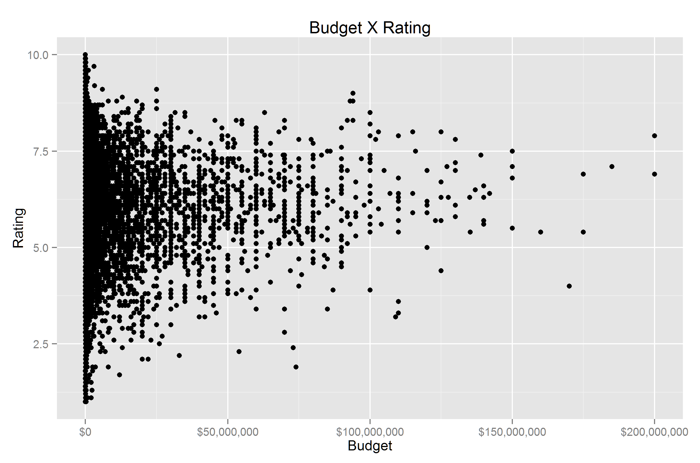

Homework 1: Basic Charts
==============================

| **Name**  | Octavio Suarez Munist  |
|----------:|:-------------|
| **Email** | osuarezmunist@dons.usfca.edu |

## Instructions ##

Change to desired working directory and run hw1.r to produce all 4 charts.

## Discussion ##

###Problem 1###
Not much of a story here due to blob of low-budget movies. Changed x-axis labels so dollars amounts are legible.

###Problem 2###
Removed unneeded major vertical and minor horizontal grid lines.

###Problem 3###
Changed x-axis labels to fit in reduced space due to multiple charts per row.

###Problem 4###
Since I do author b&w manuscripts regularly, I use color infrequently. Here, I used ColorBrewer palette to ensure colors did not create visual distractions.

