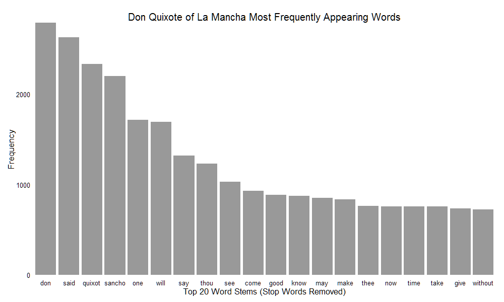

Homework [#]: [HOMEWORK NAME]
==============================

| **Name**  | Octavio Suarez Munist  |
|----------:|:-------------|
| **Email** | [osuarezmunist@dons.usfca.edu |

## Instructions ##

Each R files contains all code necessary to generate the corresponding plot. First, make sure you downlaoded the directories, DQen and DQenC. All files should be in the same workign directory.

## Discussion ##

I chose a book, Don Quixote of La Mancha by Cervantes as my corpus. The text is available in multiple languages and formats. I chose to work with the single file format for the first two visualizations, but use the chapter files for the third.

The first visualization is a simple bar chart of the top appearing words, aftere stop word removal and stemming. Interesting to see the types of words that appear, besides the proper names of the main characters. I made the image wide so the words could be read easily wihtout rotation. I kept the height proportional to avoid distortion.

What can you say about a Wordcloud? So 2010! Played around with the prameters to get a "sphere" effect. 
Good to grab peoples attention, but not much else.

Finally, I thought it would be interesting to see the frequency of words by chapter, so I created a heatmap of the top 30 words. Since the counts were low, I used high contrast colors for the frequency. I rotated the words 45 degrees to save pixels. Also, I ordered the chapters from bottom to top, as the scales pulled the eye towards the bottom left corner.

