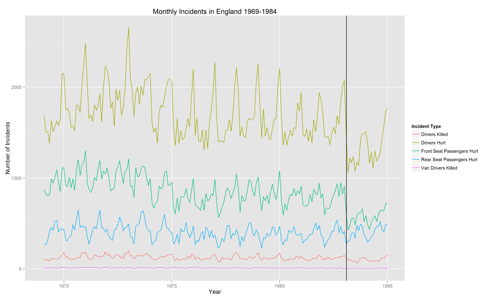
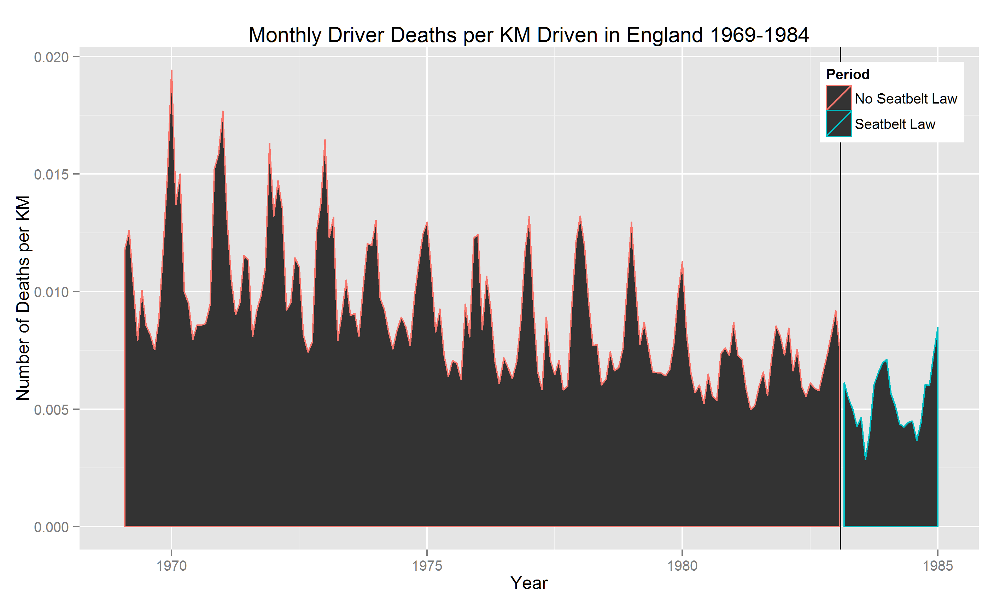

Homework [5]: Time Series
==============================

| **Name**  | Octavio Suarez Munist  |
|----------:|:-------------|
| **Email** | osuarezmunist@dons.usfca.edu |

## Instructions ##

Run script to produce plots

## Discussion ##

The Seatbelts data sets presents several challenges, as it is a time series with a clear seasonal cycle. Additionally, it there are a number of measured changes of the time period, including the enactemetn of a seatbelt law in 1983 and changes in miles driven over time. Since the data set only goes until 1984, the seatbelt law is only in effect for 2 of the 16 years if data. Furthermore, there are many known changes to cars and driving habits not incldued in the data set. 

Also, multiple accident variables are reported, inlcuding deaths and injuries. I chose to look at deaths, as these seem to be the outcome that would not change over time.

To show the impact of the seatbelt law on driver deaths, I plotted 5 time series together:

From these I picked Drivers Killed as the more interesting seris, as van drivers was too small and the other ones mixed deaths and injuries, which seemed to be affected more by incidents before teh Seatbelt Law.

To account for increases in KMs driven, I converted the numberof deaths to a rate. I used color and a vertical bar to mark the enactement of the Seatbelt Law.

Due to the cyclical nature of the data, I used a star plot to show the trend of decreasing vehicular deaths over time, but not clear if this was a results of the law.

